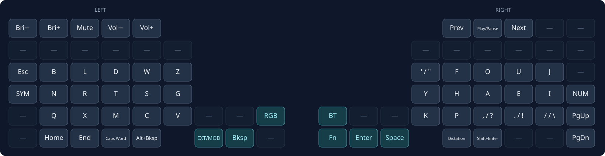
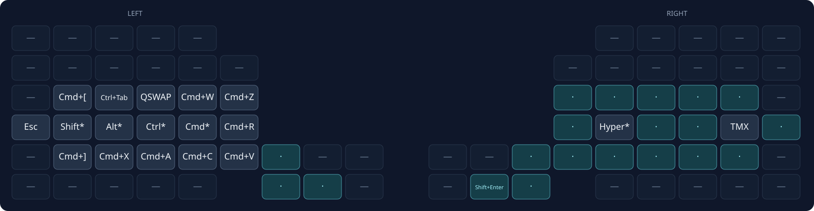
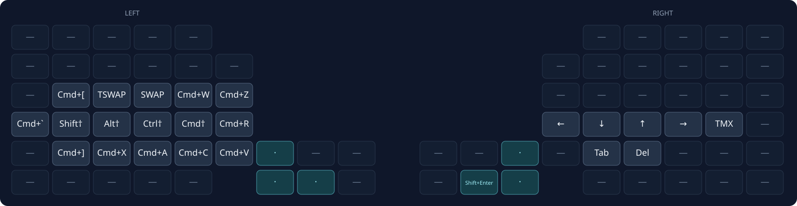
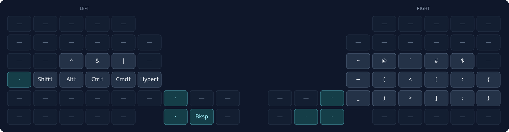
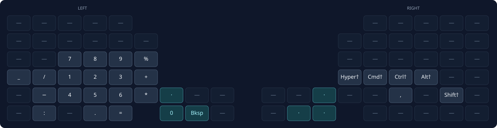
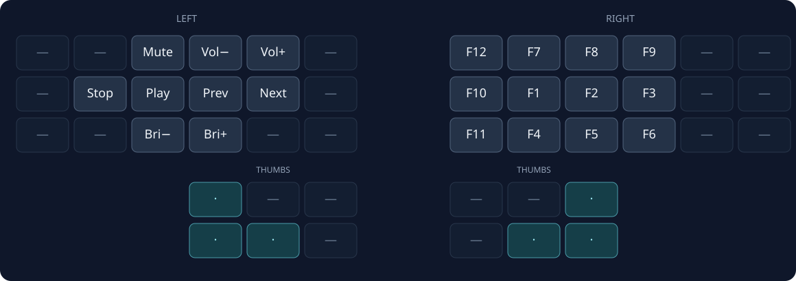
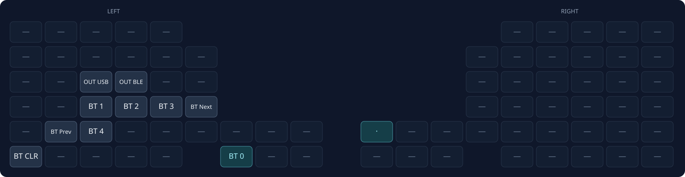

# Glove80 Graphite Layout

Each diagram shows the finger keys and both rows of thumb keys in **keyboard
viewing order**, with the left half on the left. Spacing is simplified.
The unused finger rows are omitted.

- `—` = disabled; `·` = transparent (uses the lower active layer).
- `*` = tap for sticky modifier, hold for held modifier; `†` = sticky modifier.
- Two labels separated by `/` show normal / shifted output.
- Hyper = Ctrl+Alt+Cmd+Shift.

## BASE

Default layer.

## MOD

**Tap EXT/MOD** for a sticky next-key layer.

QSWAP switches to the previous app, releasing Cmd immediately.
TMX sends Ctrl+Space (tmux prefix).

## EXT

**Hold EXT/MOD** for navigation and editing.

- Cmd+Grave cycles windows.
- SWAP holds Cmd across Tab taps; TSWAP holds Ctrl across Tab taps.
- Sticky Shift reverses cycling. Leaving EXT or pressing a non-ignored key
  ends the switcher.
- TMX sends Ctrl+Space (tmux prefix).
- Right Alt is for dictation.

## SYM

**Tap SYM** for a sticky next-key layer; **hold** for a sequence.
Modifier presses do not consume the sticky layer. Sticky modifiers stack.

Braces are available through combos below.

## NUM

**Tap NUM** for a sticky next-key layer; **hold** for a sequence.
Modifier presses do not consume the sticky layer. Sticky modifiers stack.

## MF

**Hold SYM + NUM together** from BASE.

## BT

**Hold EXT/MOD + NUM together** from BASE.

`BT CLR` clears the selected host profile; BT 0–4 select profiles.
`OUT USB` / `OUT BLE` select the output independently of the Bluetooth profile.
RGB controls: toggle, hue up/down, brightness up/down, next effect, saturation up/down.

## Combos

Positions refer to keys on BASE.

| Layer | Chord | Result |
| --- | --- | --- |
| EXT | H + A (Down + Up) | Option+Left (word left) |
| EXT | A + E (Up + Right) | Option+Right (word right) |
| SYM | H + A (`(` + `<`) | `{` |
| SYM | P + comma (`)` + `>`) | `}` |
| BASE | SYM + NUM | Hold MF |
| BASE | EXT/MOD + NUM | Hold BT |
