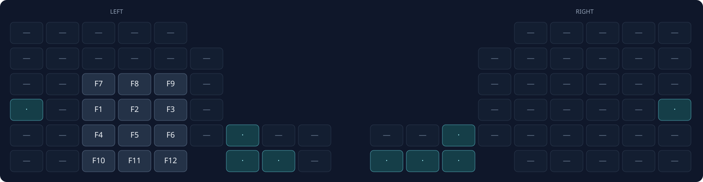
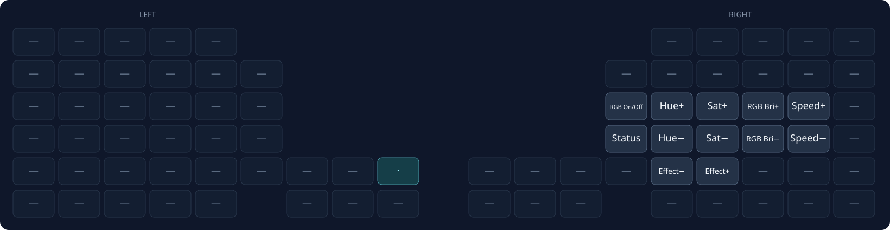

# Glove80 Layout

Full keyboard layouts, including disabled keys and both thumb rows.

- `—` = disabled; `·` = transparent (uses the lower active layer).
- `*` = tap for sticky modifier, hold for held modifier; `†` = sticky modifier.
- `/` separates normal and shifted output.
- Hyper = Ctrl+Alt+Cmd+Shift.

## BASE

SYM/NUM use the pinky columns beside the home row: tap for sticky activation; hold for momentary activation. Their former thumb keys are disabled.

Caps Word sits under M, between End and Alt+Backspace; the former pinky Shift is disabled. Tap to toggle uppercase letters without native Caps Lock. Default ZMK behavior continues through letters, digits, underscore, Backspace, and Delete; Space, Enter, Escape, and other punctuation turn it off. Layer triggers alone do not turn it off.

## MOD

## EXT

## SYM

## NUM

## Fn

## BT

## RGB

